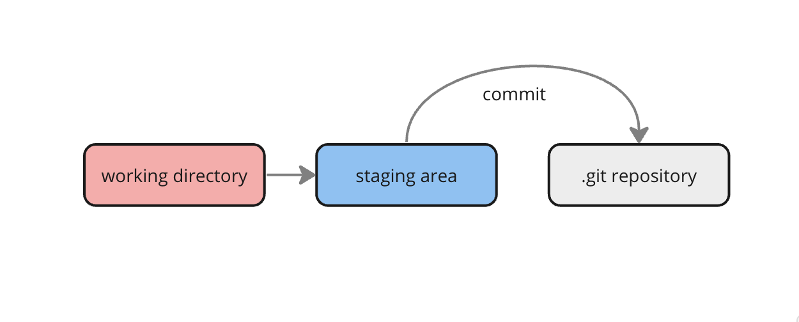
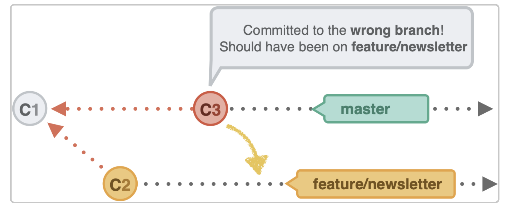

### Commits

Commit is the snapshot of the project taken by git. Snapshots are always committed to the local git repo



```shell
git commit -m <commit_message>
```

---

### Writing commit messages properly

The **Conventional Commits** specification provides an easy set of rules for writing commit messages properly.

```
<type>[optional scope]: <description>

[optional body]

[optional footer(s)]
```

**Types with Examples**

1. fix: - for bug fixes
2. feat - for new features
3. BREAKING CHANGE (use ! to draw attention)
4. Other types ( build:, chore:, refactor:, test:, style: , docs:)

**Examples**

```
fix: Resolve issue with user registration
```

```
feat: Add user authentication feature
```

```
refactor: Extract validation helper function
```

```
chore: Clean up unused dependencies
```

**Commit messages with scope**

```
feat(lang): add Polish language
```

_Use ! to draw attention to a commit_

```
feat!: allow provided config object to extend other configs

BREAKING CHANGE: `extends` key in config file is now used for extending other config files
```

**Commit message with body and footer**

```
feat: Implement user authentication

Add a new feature to allow users to authenticate using email and password.

- Add login form component
- Implement authentication API endpoints
- Store user authentication tokens in local storage

Closes #123

Co-authored-by: Aashima Ahuja <aashi@example.com>
```

**Note**: Use present tense while drafting commit messages like it should be **Implement user authentication** and not **Implemented user authentication**

Further reads

https://www.conventionalcommits.org/en/v1.0.0/

---

### Moving a commit to another branch



1. git log and copy the commit hash of the commit you want to move
2. swicth to the branch where you want to move the commit

```
git checkout <branch_name>
git cherry-pick <commit_hash>
```

[Branches](branches.md)
