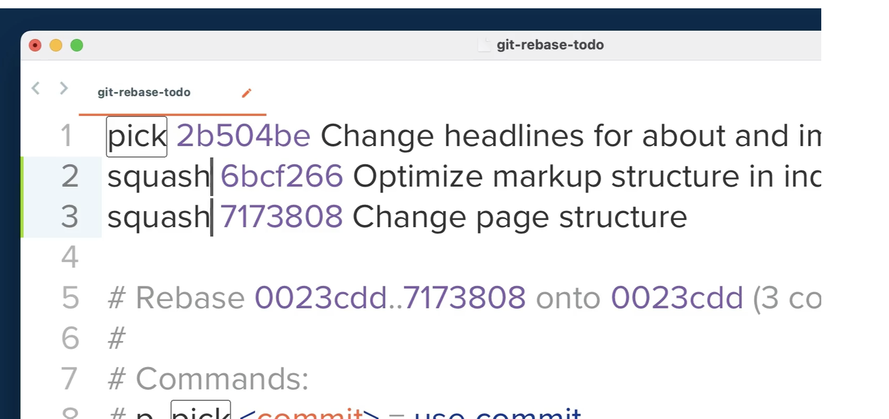

#### Squashing

To "squash" in Git means to combine multiple commits into one.

**When to Squash ?**

Depends on what you have decided as a team. Instead of many individual commits which might be unnecessary only a single commit appears in the main commit history. This can be helpful in keeping commit history clean!

**How to squash**

**_Using Interactive Rebase_**

```
git rebase -i HEAD~3
```



**_Using Merge_**

```shell
git merge --squash feature/authentication

```

**Merging without squash**

New merge commit is automatically created by git


**Merging with Squash**

Manual commit , no automatically added by git


**Pull requests**

A lot of git hosting platforms like github , gitlab , bitbucket provides an option to squash the commits when merging a PR


[Rebasing commits](rebase.md)
